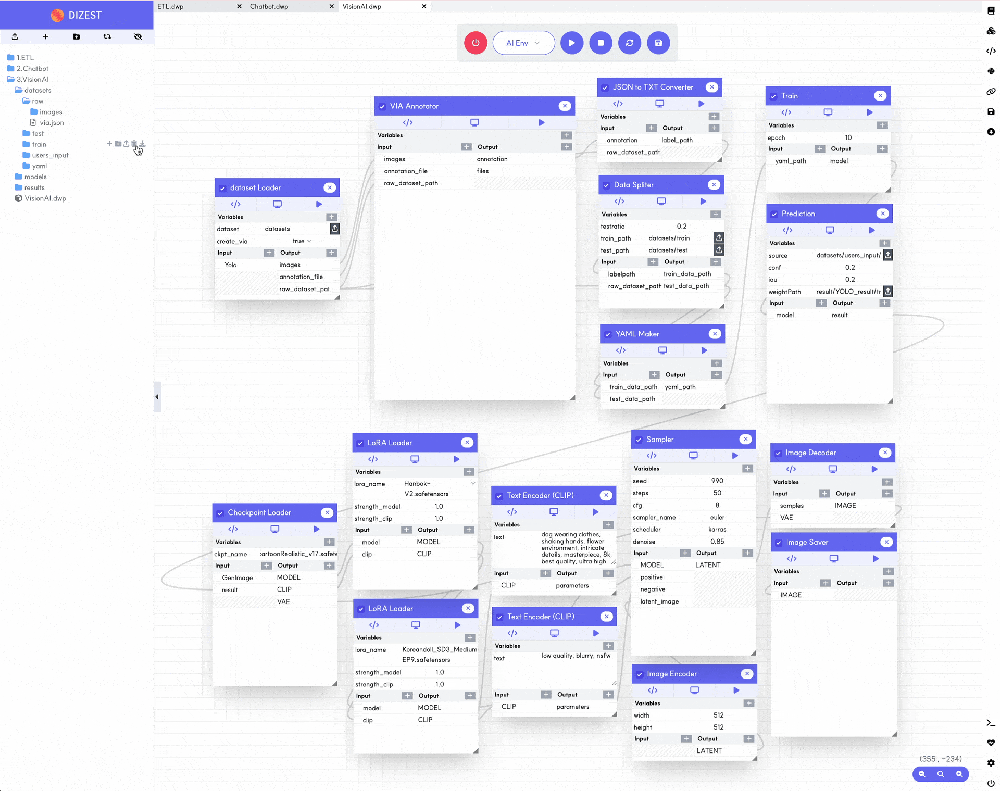

## :small_blue_diamond: Labeling function in DIZEST

:point_right: Users can leverage Data Labeling directly in DIZEST without the need for external tools.

## :small_blue_diamond: Drag-and-Drop function in DIZEST

:point_right: Users can develop the same apps on the same or different Canvases using Drag-and-Drop functions without repetitive tasks.

## :small_blue_diamond: Flexible Workflows in DIZEST

:point_right: Users can create or utilize workflows that are strictly sequential, as well as workflows that run through flexible relationships between apps. 