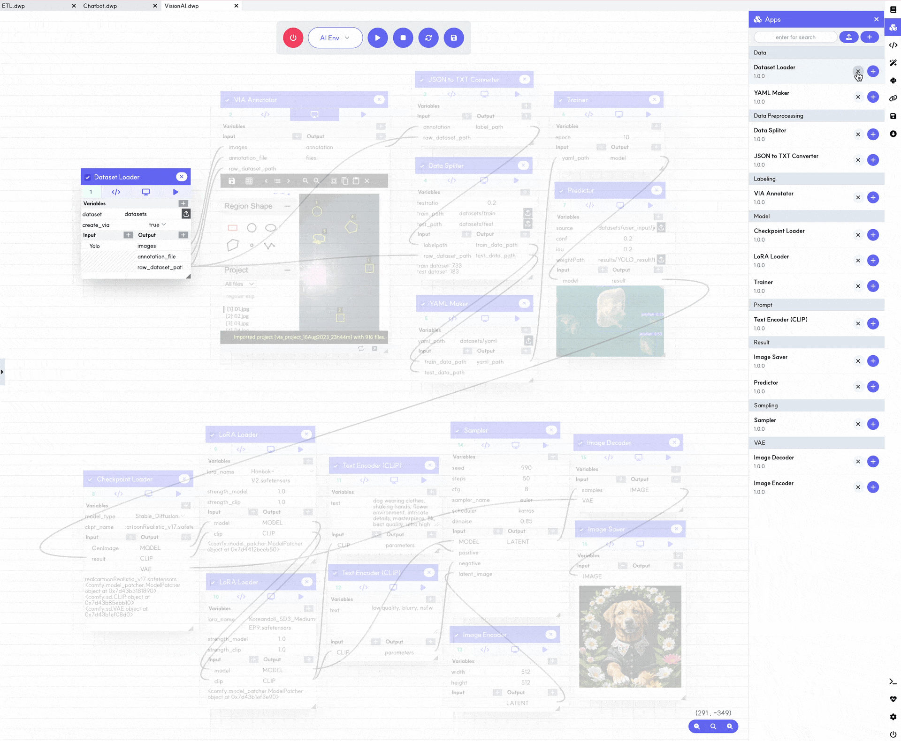

## Labeling function in DIZEST

Users can leverage Data Labeling directly in DIZEST without the need for external tools.

## Drag-and-Drop function in DIZEST

Users can develop the same apps on the same or different Canvases using Drag-and-Drop functions without repetitive tasks.

## Flexible Workflows in DIZEST

Users can create or utilize workflows that are strictly sequential, as well as workflows that run through flexible relationships between apps. 