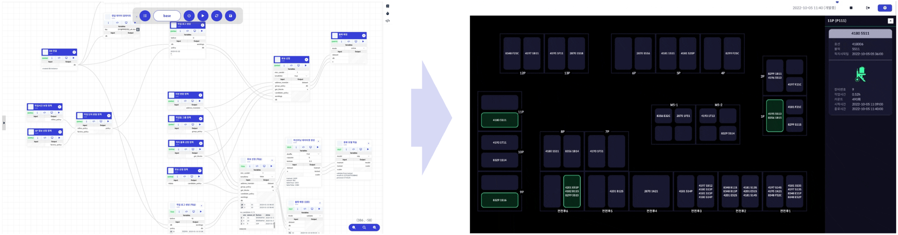
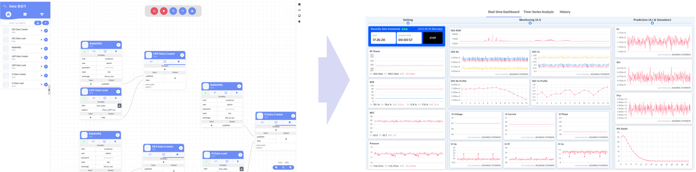
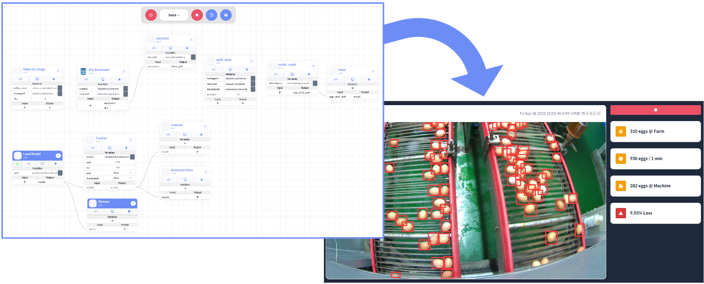
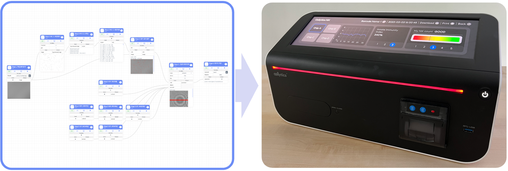
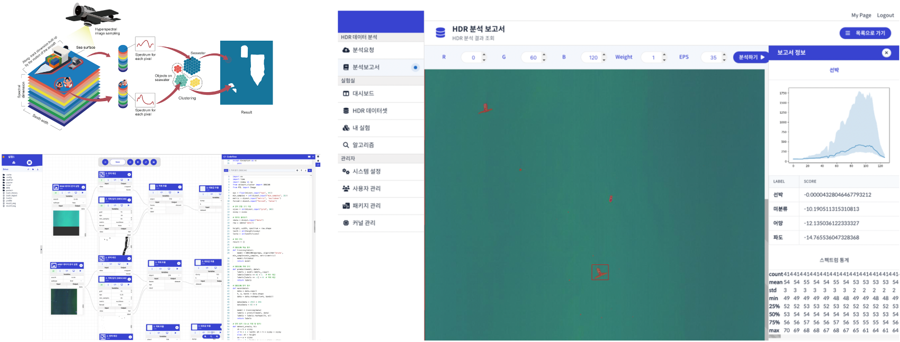

# :black_circle: Smart Manufacturing

## :small_orange_diamond: Shipyard Automation

The shipbuilding industry is a large-scale industrial field with complex processes and various specialized fields intertwined. Therefore, efficient communication between field personnel and the research and development team is important. DIZEST played a particularly important role in this shipyard environment. Shipyard field personnel have specialized knowledge and experience, but often lack expertise in machine learning or data science. DIZEST played a role in connecting this empirical knowledge with machine learning technology.

## :small_orange_diamond: Semiconductor Equipment Monitoring

Equipment used in the semiconductor industry has an organically connected structure that generates various electrical signals and generates a large amount of data in a short period of time. We succeeded in developing a real-time equipment status monitoring tool using DIZEST to analyze numerous information generated from plasma equipment, which is one of the equipment used in the semiconductor industry.

# :black_small_square: AgriTech and Biomedicine

## :small_orange_diamond: Edge Computing at Agricultural

The agricultural sector has a very poor environment for introducing ICT technology. Heavy machinery and equipment are used on farms, which can damage sensors and devices. Additionally, many farms are located far from urban centers and may have weak communications infrastructure. This can make real-time data transmission or remote control difficult. To solve these problems, DIZEST secures a level of performance that can be used in edge devices and is also considering application in harsh environments.

## :small_orange_diamond: Bio Technology

DIZEST has also been used for cell analysis research using lens-free technology. Even biotechnology researchers who are not familiar with code development can easily conduct machine learning-based research. In fact, the biotechnology research team adopted DIZEST and achieved results that improved the accuracy of experimental design, shortened data analysis time, and improved the quality of research results.

# :black_small_square: Maritime Emergency Response

## :small_orange_diamond: Hyperspectral Image analysis

The technology for detecting maritime objects in hyperspectral aerial images is a technology closely related to maritime safety, such as saving lives in the event of a maritime accident or detecting floating objects on the sea. DIZEST was used as a research tool to develop this technology and was used to derive various research results, including SCI papers, and demonstrated that large-scale data processing is possible.
